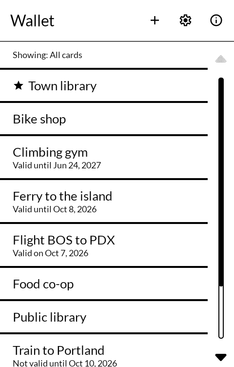
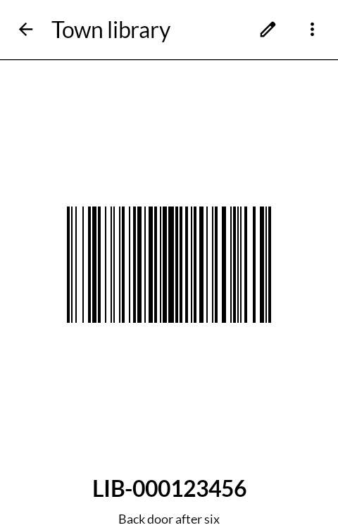
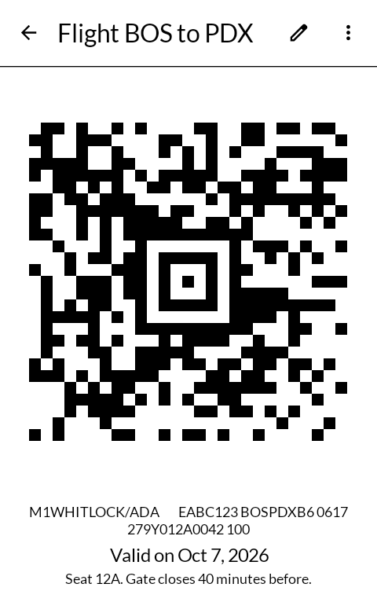
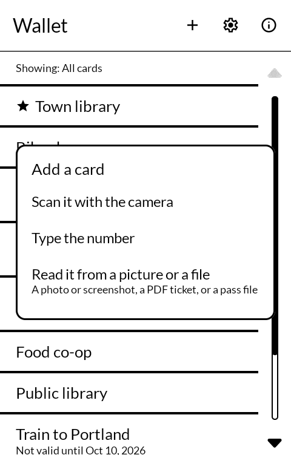

# Wallet

札入 *satsuire*

Loyalty cards, library and membership cards, event tickets and boarding passes, kept on the
phone and shown as barcodes a scanner can read off an E Ink screen.

Built for the [Mudita Kompakt](https://mudita.com/products/kompakt/), whose 4.3" panel has
sixteen greys, a slow redraw, and is read outdoors as often as indoors.

## Screenshots

| | | | |
|---|---|---|---|
|  |  |  |  |

## What it does

- **Show a card.** The barcode fills what the screen has, pure black on pure white, with the
  white margin a scanner needs around it. Every bar is a whole number of pixels wide, so there
  is no grey edge for the panel to soften; a long code is turned to run down the screen when
  that makes its bars wider. The number is written out under it for a cashier to type when a
  scanner will not read. The screen stays awake while a card is open.
- **Add a card** by scanning it with the camera, by typing the number and choosing the kind of
  barcode, or by reading it from a picture: a screenshot, a photo, a PDF ticket, or an Apple
  Wallet pass file (`.pkpass`).
- **Tickets and passes**: a card can have a first and a last day. The list says when one has
  expired or is not valid yet. Boarding passes use Aztec or PDF417, and both are drawn.
- **Favourites** sit at the top of the list, marked with a star.
- **Groups** sort cards into kinds — travel, shops — and the list shows all of them or one
  group. **Order** is by name, last used, last added, or soonest to expire or to start.
- **Put away** a card that is finished with; it leaves the list and waits at the bottom of it.
- **Bring cards in** from an export made by [Catima](https://catima.app), FidMe or Voucher
  Vault, and **save every card** to a Catima file, which Catima reads back.

Barcode kinds: Aztec, Codabar, Code 39, Code 93, Code 128, Data Matrix, EAN-8, EAN-13, ITF,
PDF417, QR Code, UPC-A and UPC-E.

## With the other apps

- **Share a picture** from Gallery, Camera, Email or Messaging and choose Wallet: it reads the
  barcode in it and opens a new card with it. A PDF ticket and a pass file work the same way.
  Shared text becomes the card's number, and a Catima share link becomes the whole card.
- **A pass file opened from Files or Email** opens here.
- **Add to calendar** puts a ticket's days into Calendar, or any calendar app that takes
  Android's request to add an event.
- **Share** sends a card's barcode as a picture with its name and number, so another phone
  can scan it, or read it into its own Wallet.
- **Glance** lists today's tickets by name on the lock screen: a flight today, a ferry ticket
  good for the weekend. Off in settings if it is not wanted.
- **Files** is where exports go and come from: Android's own file picker shows it.

## What it does not do

No colours, card photos, balances, NFC or watch app: those parts of Catima are left out.
Groups and the other fields a Catima export carries come in and go back out unchanged.
No internet, and no cloud: the cards are only on the phone and in the files you save.

## Building

```
./gradlew assembleRelease
```

A release is signed by a keystore in `signing/`, which is not in this repository. Without
it the release APK builds **unsigned** and will not install anywhere — there is no
fallback key by design.

## Getting it, and keeping it

Download <https://github.com/wanderwildwood/satsuire/releases/latest/download/satsuire.apk>
and sideload it. That address always points at the newest release, and every release
publishes a `.sha256` beside the APK.

For updates without doing this by hand, add this repository to
[Obtainium](https://github.com/ImranR98/Obtainium):

    https://github.com/wanderwildwood/satsuire

## Credit

A fork of [Catima](https://github.com/CatimaLoyalty/Android), GNU General Public License v3
or later, whose history this repository keeps. Its database, its barcode, picture, PDF and
pass readers, its importers and exporter, and their tests are Catima's, under
`app/src/main/java`. The screens are written fresh in Jetpack Compose against
[MMD](https://github.com/mudita/MMD), Mudita's E Ink component library.

Barcodes are drawn and read by [ZXing](https://github.com/zxing/zxing), and scanned with
[ZXing Android Embedded](https://github.com/journeyapps/zxing-android-embedded), both Apache
License 2.0. Icons are [Material Symbols](https://fonts.google.com/icons), Apache License 2.0.

## Licence

GPL-3.0-only for what is written here. See [LICENSE](LICENSE). Catima's own files keep the
licence they came under, GPL-3.0-or-later.

Copyright (C) 2026 wander wildwood

This program is free software: you can redistribute it and/or modify it under the terms of the
GNU General Public License as published by the Free Software Foundation, version 3.

This program is distributed in the hope that it will be useful, but WITHOUT ANY WARRANTY;
without even the implied warranty of MERCHANTABILITY or FITNESS FOR A PARTICULAR PURPOSE. See
the GNU General Public License for more details.

You should have received a copy of the GNU General Public License along with this program. If
not, see <https://www.gnu.org/licenses/>.
